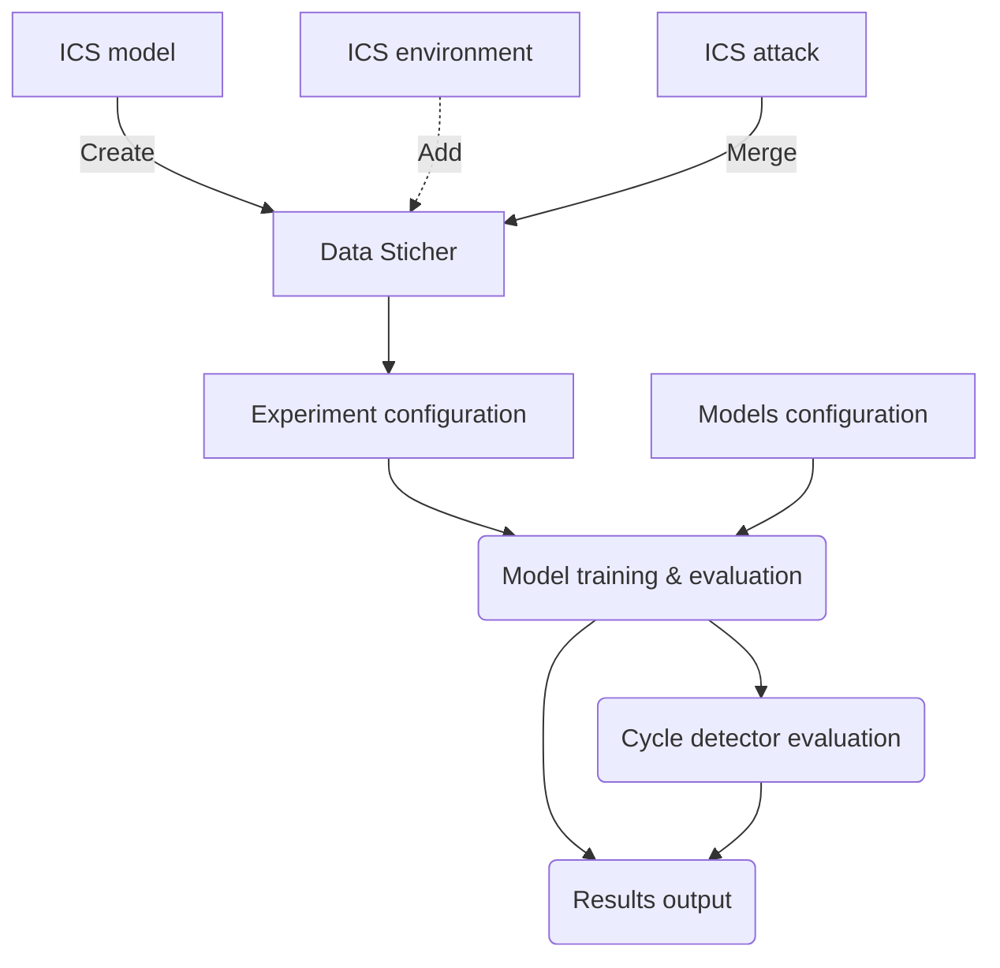

# [ADEF](a "Anomaly Detection Evaluation Framework")- Anomaly Detection Evaluation Framework for Industrial Control Systems
&copy; Collins Aerospace Proprietary - Created at ART-Ireland, UNCTD (EU)
 Copyright Collins Aerospace Ireland, Limited 2024

## 1. Introduction
The purpose of this software is to help evaluate various anomaly detection models against attacks running in industrial control systems ([ICS](a "Industrial Control System")). The simulation framework helps compare performance of [AD](a "Anomaly Detection") models in uniform fashion by applying series of standard model metrics. As a result of comparison various [AD](a "Anomaly Detection") models can be helpful to tailor real cybersecurity solutions without need of running real tests on expensive infrastructure.


## 2. Prerequisites & Installation
### 2.1 HW Requirements
A minimum of 8GB RAM is recommended for optimal performance. The larger datasets and [AD](a "Anomaly Detection") models with increased internal complexity (i.e. Deep Learning) and larger number of experiments would require more computational power and RAM memory.

### 2.2 SW Requirements
The framework requires following to be installed on the OS host system:
1. Python3 [`version 3.11`](https://www.python.org/downloads/release/python-3112/).
2. Python package manager [PIP](https://pip.pypa.io/en/stable/installation/#get-pip-py)
   is also required to help install required Python packages. 
3. **C compiler tools**, the tools are required for Python packages dependencies compilation and installation.
    This requirement is a must in case of Python package needs to be built from source code for given OS platform/CPU configuration that is not available in pre-packaged format. To simplify this process instruction set is listed below for most used platforms :
    - **Windows** - Microsoft documentation on how to install free version for MSVC C/C++ compiler on Windows machines is available at this link [https://learn.microsoft.com/en-us/cpp/windows/latest-supported-vc-redist?view=msvc-170](https://learn.microsoft.com/en-us/cpp/windows/latest-supported-vc-redist?view=msvc-170).
    - **Linux/Debian/Ubuntu**
        ```
        sudo apt update -y
        sudo apt install gcc -y
        sudo apt install build-essential -y
        ```
    - **Linux/Fedora/CenOS/RedHat**
        ```
        sudo dnf update -y
        sudo dnf install "C Development Tools and Libraries" -y
        ```
    - **MacOS**
        Please refer to manual instruction available at [MacOS C++ installation](https://www.cs.rhodes.edu/~kirlinp/courses/cs2/s17/installing-clion/xcode.html)

    For other platforms please refer to [Python support list](https://www.python.org/download/other/) to check whether given platform can support this type of installation.
---

**WARNING:**

Please treat above instruction with caution as specific OS C/C++ installation instruction might differ from
this instruction. Over time OS updates and different versions of the same OS might alter installation process. 
Before installing C/C++ environment please refer to current OS version guideline on how to install C/C++ 
compiler environment.

---

### 2.2.1 PyKalman Module Patch For Python 3.1X+
The framework is using Kalman filter ([pykalman](https://pypi.org/project/pykalman/)) as one of the methods to de-noise input data as part of automated data stiching step. 
When using Python 3.11+ and after [ADEF](a "Anomaly Detection Evaluation Framework") installation of the pykalman filter small file patch is applied to make the filter work properly in higher Python revision. This done to fix changes of more recent Python features that were used in single function inside Kalman filter module that were causing a runtime error when run on the original code.
The fix is automatically scripted into the installation script, so there is no need to do anything related to the patch afterwards.

### 2.3 Installation
There are two modes of installation available for [ADEF](a "Anomaly Detection Evaluation Framework"):
- PyPi package - this is simplified version of the installation that requires only Python package installation,
- Direct - in this mode repository needs to be cloned from GitHub and installation script is required to complete the installation process.

#### 2.3.1 Package installation
To install [ADEF](a "Anomaly Detection Evaluation Framework") framework as Python package please run following command:

***Windows OS***:
```commandline
pip install adef
```

***Linux based OS***:
```commandline
pip3 install adef
```

This command will install [ADEF](a "Anomaly Detection Evaluation Framework") and all related packages on the corresponding system/environment.

#### 2.3.2 Direct installation
This section describes direct installation mode from GitHub source code. The installation is divided into two main steps: 
 - 1) pulling the code from GitHub, 
 - 2) running installation script.

##### 2.3.2.1 Cloning repository
The first step is to clone [ADEF](a "Anomaly Detection Evaluation Framework") repository to local system. To do this please run:
```
git clone [TBD repository-url]
```
The alternative is to unpack [zipped](https://www.7-zip.org/) repository to local folder.

##### 2.3.2.2 Installation
Next step is to install all required Python3 packages and patches used by [ADEF](a "Anomaly Detection Evaluation Framework") by running following command:
***Windows OS***:
```commandline
python install.py
```

***Linux based OS***:
```commandline
python3 install.py
```

Please note that the installation process has been scripted to reduce installation process complexity.
After successfull installation the [ADEF](a "Anomaly Detection Evaluation Framework") is ready for use.

## 3. Project Structure

The [ADEF](a "Anomaly Detection Evaluation Framework") project structure is following standard Python project layout and is extended to match [ADEF](a "Anomaly Detection Evaluation Framework") requirements. The structure is as follows:

    .
    ├── cfg                     # [ADEF](a "Anomaly Detection Evaluation Framework")configuration folder
    ├── docs                    # Documentation files include images for this document
    ├── exp                     # Experiment designs modules
    ├───┭─ icsr                 # ICS system representation module
        ├── models              # ICS model files
        └── threats             # ICS attack examples
    ├───┭─ mev                  # Model evaluation module
        ├── adm                 # Anomaly detection model definitions (wrappers and own)
        ├── cd                  # Cycle detector model implementation
        ├── data                # Data enginering and filtering implementation
        ├── metrics             # Metrics implementation
        └┭─ result              # Result generation implementation
         ├── latex              # LaTeX result generation code
         └── ppt                # Power Point generation code
    ├── patch                   # Python library patch files
    ├── tests                   # Automated tests (using Python test framework)
    ├── tools                   # Tools and utilities for [ADEF](a "Anomaly Detection Evaluation Framework") 
    ├─ adef.py                  # Main [ADEF](a "Anomaly Detection Evaluation Framework")startup file
    ├─ GT_README.md             # Global trade project annotation
    ├─ install.py               # Python [ADEF](a "Anomaly Detection Evaluation Framework")framework installation script
    ├─ LICENSE.txt              # License description
    ├─ README.md                # [ADEF](a "Anomaly Detection Evaluation Framework")project documentation
    ├─ requirements.txt         # Python packages requirements file
    └─ setup.py                 # Setup project for PyPi use

## 4. Simple Start
To run [ADEF](a "Anomaly Detection Evaluation Framework") framework with default ICS model and attacks please run following command:

Windows OS:
```commandline
python adef.py
```
Linux based OS:
```commandline
python3 adef.py
```
This command will run out of the box [ADEF](a "Anomaly Detection Evaluation Framework") simulation with simple anomaly detection models.
Please note that the [ADEF](a "Anomaly Detection Evaluation Framework") simulation start is always looks the same. The difference depends on [ADEF](a "Anomaly Detection Evaluation Framework") configuration.
Next chapter will illustrate on how to modify [ADEF](a "Anomaly Detection Evaluation Framework") configuration to run more complex simulations tailored to user requirements.

### 4.1 Architecture

<center>
    <figure>
        
        <figcaption>Fig.1. ADEF architecture.</figcaption>
    </figure>
</center>

The [ADEF](a "Anomaly Detection Evaluation Framework") overall architecture is illustrated on Fig.1. The framework is composed of three main elements.

- ICS Representation - this module is responsible for data generation for ICS model, ICS attacks and environmental influence that will be used in the simulation process. All inputs are either supplied in form of CSV file or custom-made Python code that generates input in form of Pandas DataFrame.
- Experiment configuration - takes role of configuring simulation experiments and model sets with corresponding search parameters for best model selection elected in simulation process.
- Model evaluation - performs models evaluation by running model parameter search. It starts with data input stiching and applying experiment configuration. Next step is to run all selected models with search parameters. During simulation depending on the configuration a set of the model parameters are evaluated to select best model configuration. In case of using statistical ML models a [CD](a "Cycle Detector") model is used to compare results. In the last step all simulation results are aggregated. The result section generates series of presentation slides using [pptx](https://pypi.org/project/python-pptx/) library. The content is composed of all metrics, ICS attacks and ICS model input combined to help visualize all results in comprehensive simulation overview process.


### 4.2 Operation
The [ADEF](a "Anomaly Detection Evaluation Framework") simulation flow is organized as follows:



The simulation process flow starts with data inputs provisioning or generation via code. Next the data is combined and cleaned by data input module and prepared by experiment configuration for simulation process. The experiment configuration might tailor data further depending on the experiment requirements.
At the moment there are following experiment designs implemented:
 
 - **Baseline** - This is the default setting for the experiment without applying any changes on data against selected [AD](a "Anomaly Detection") models. It runs the model against given dataset and measures performance.
 - **Amount of Data** - The experiment is designed to evaluate how the amount of data will influence performance of given [AD](a "Anomaly Detection") model. It runs number of sub-experiments where each of them iterates over percentage of data inside dataset. The default setting is 10%-100% with 10% step.
 - **Model knowledge** - This experiment is designed to test [AD](a "Anomaly Detection") model knowledge and validate model behavior against novel attacks. It runs number of sub-experiments where number of attacks are not visible in training data set and all of them are visible evaluation training data set. The default configuration is starting with 2 out 9 attacks to all attacks in training data set.
 - **Model skew** - The aim of this experiment is to evaluate long term environmental changes inside dataset influence on [AD](a "Anomaly Detection") model that was trained without it. The input data is modified to contain additional feature disturbances in evaluation dataset while training dataset is used without it.

Each of the experiments can be enabled/disabled and new experiment designs can be added to fulfill simulation needs.
Next each experiment trains all enabled [AD](a "Anomaly Detection") models on the supplied data and evaluates performance in second phase of the simulation.
If models were statistical ML type then a cycle detector model is used to perform further evaluation on [CD](a "Cycle Detector") model.
The [ADEF](a "Anomaly Detection Evaluation Framework") assembles all results and completes simulation with results. The output that can be used to assess [AD](a "Anomaly Detection") model performance against adverse conditions defined in the experiment configuration.

At the end of the simulation run will create following directory structure:

    .
    ├── attack                  # Generated/stored attack data used in simulation plus generated attack traces
    ├── cfg                     # Copy of [ADEF](a "Anomaly Detection Evaluation Framework")configuration for simulation instance
    ├── checkpoint              # Simulation checkpoint trace to enable pause and resume function in case of simulation failure
    ├─┭ experiments             # Experiments folder containing simulation results
      ├── <exp_name_1>          # Experiment #1 that was executed as part of simulation run
      ...
      └── <exp_name_N>          # Experiment #N that was executed as part of simulation run
    ├── input                   # ICS input data with data graphs
    └── timing                  # Time measurements for each overall simulation step

whereas under experiments folder experiment names folder are will be listed and under each of them following folder structure will be visible:
    
    .
    ├── attack                  # Tailored experiment attack data
    ├── checkpoint              # Experiment checkpoint progress
    ├── detection               # Results of [AD](a "Anomaly Detection") Models evaluations
    ├── graph                   # Graphs generated for results
    ├── input                   # Tailored ICS inputs
    ├── model                   # Trained [AD](a "Anomaly Detection") models
    ├─┭ output                  # Obtained experimental results
      ├── latex                 # LateX formatted tabular results from experiment excecution
      └── ppt                   # Power Point slides generated out of simulation run
    └── timing                  # Time measurements for each experiment simulation step

## 5. Configuration
This section describes [ADEF](a "Anomaly Detection Evaluation Framework") configuration settings and explains how to configure framework to make the simulation runs that will fit custom-made inputs and models. The [ADEF](a "Anomaly Detection Evaluation Framework") is using [YAML](https://docs.ansible.com/ansible/latest/reference_appendices/YAMLSyntax.html) notation to configure all simulator elements. Reason for that is YAML enables user to make comments thus making configuration more flexible where multiple copies of given element can be kept for later user. In comparison, JSON format does not allow for any comments thus limiting editing flexibility. To expand configuration flexibility elements related to [AD](a "Anomaly Detection") model section the search parameter are configured using native Python code. This approach helps to add more customization flexibility through automatic range generation for model search parameters.

### 5.1 ICS Representation
The ICS representation is divided into three input data parts. First describes behavior of industrial model that is explored in simulation process. Second part defines ICS attacks where the model signal is changed to desired attack type. Last element adds the external environment influence that might change ICS model behavior during experimentation.

#### 5.1.1 ICS Model
The ISC model main configuration is stored in config/main/process.yml file. Depending on the ICS needs either direct file input can be feed to [ADEF](a "Anomaly Detection Evaluation Framework") framework through filling variable `process->in_file` or creating under `process` variable. The example configuration for autoclave process is as follows:

| Field name | Type | Example value | Description | 
| --- | --- | --- | --- | 
| path | *str* | "input/" | Sub-path where process generation files will be sorted |
| in_file | *str* | "" | Input file that supplies input data to [ADEF](a "Anomaly Detection Evaluation Framework") for ICS Model |
| cycles | *int* | 100 | Number of temperature test cycles used in training |
| detection_cycles | *int* | 100 | Number of different temperature cycles used in detection |
| cycle_len | *int* | 50 | Length of the cycle in data samples |
| samples | *int* | 6 | Number of samples per single unit of measurement (frequency) |
| limit | *int* | 3 | Allowable error % limit in manufacturing environment (% of errors that can be skipped - manually handled) |
| max_value | *int* | 225 | Maximum value on the input graphs |

In `profile` section of the ICS model the production process is defined. Below an example of the process limit definition is supplied.
| Field name | Type | Example value | Description | 
| --- | --- | --- | --- | 
| enabled | *int* | 1 | To generate new data set the flag to 1 otherwise data will be loaded from the file (flag = 0) |
| file | *str* | "data_area1_3K_DN.csv" | Output data file |
| temp | *N/A* | N/A | Thermal process parameters |
| temp.optimal_heating | *list<float>* | [182, 185] | Example of maximum Y axis values that will be set to emulate ICS system |
| temp.room | *list<float>* | [18, 19] | Example of minimum Y axis values that will be set to emulate ICS system |
| temp.duration | *N/A* | N/A | Duration section that defines X axis elements of the ICS production process |
| temp.duration.set | *list<list<float>>* | [ [45, 55], [90, 110], [180, 240], [245, 260] ] | X axis values where Y axis values are being changed by the ICS process |

#### 5.1.2 ICS Attacks
ICS attack configuration is stored in `config/main/attack.yml` file. The configuration is divided into common attack configuration part and
specific part listed under `type` section of the configuration.
The main part is as follows:

| Field name | Type | Example value | Description | 
| --- | --- | --- | --- | 
| enabled | *int* | 1 |  To generate new attack data set the flag to 1 otherwise data will be loaded from the file (flag = 0) |
| path | *str* | "attack/" | Sub-path that will be used in attack generation data |
| number_of_attacks_per_cycle | *int* | 1 | Number of attacks per cycle | 
| single | *bool* | False | Flag to enable/disable single attacks in training/evaluation traces | 
| mixed | *bool* | True | Flag to enable/disable mixed attacks in training/evaluation traces | 
| densities | *float* | - 0.5 | List Probabilities of attack on the data set | 
| soft_filter/limit | *int* | 20 | Soft filter used to emulate physical system inertia - limit value|
| soft_filter/power | *int* | 5 | Soft filter used to emulate physical system inertia - exponent value |

The specific parts are defined under `types/<attack_name>` section as (values below are examples for constant offset attack configuration):
| Field name | Type | Example value | Description | 
| --- | --- | --- | --- | 
| enabled | *int* | 1 | Enable (1) or disable(0) attack |
| name | *str* | "coff" | Attack name |
| descr | *str* | "Constant Offset" | Attack description |
| sets | *list* | N/A | Different sets of attack configurations |
| sets/ratio | *float* | 0.5 | Ratio between attacks and normal traffic |
| sets/start | *list<float>* | [70, 90] | Time X axis ranges in measured points to start attack |
| sets/stop | *list<float>* | [225, 245] | Time X axis ranges in measured points to stop attack |
| val | *float* | 40 | Example offset value that will be applied during attack |

<center>
    <figure>
        
        <figcaption>Fig.2. ADEF attack examples.</figcaption>
    </figure>
</center>

Fig. 2 illustrates examples of default attacks implemented in [ADEF](a "Anomaly Detection Evaluation Framework") that are used in autoclave process control example supplied with framework. 
These attacks focus on light to moderate disturbance of autoclave thermal process and are as follows (from top/left to bottom/right):

- COFF - **C**onstant **Off**set - Adds randomized constant value to control signal resulting in larger than expected signal at the output of the controller,
- DOON - **DO**or Open Fan **ON** - The autoclave chamber is opened prematurely and cooling fan is turned on inside chamber,
- SETO - **SE**nsor **T**emporary **O**ff - sensor measuring temperatures is remotely turned off during production cycle,
- DOFF - **D**oor **O**pen **F**an of**F** - autoclave chamber is opened prematurely and cooling fan is turned off,
- HNFL - **H**igh **N**oise and **F**lat **L**ine - High color noise is applied at controller level to the control process and then constant setting,
- NOFF - **N**oise **Off**set - Color noise offset is applied to the autoclave control process,
- NOIS - **NOIS**e - Higher than normal color noise is applied to autoclave process,
- PLCN - **PLC** **N**oise - high PLC color noise is applied to part of autoclave process,
- SEAC - **SE**nsor **A**ctive **C**ontrol - PLC temperature sensor is hijacked and sending incorrect readings to control system causing changes in autoclave process.

#### 5.1.3 ICS Environment
The environment configuration is stored in `config/main/environment.yml` under `environment` variable. At the moment of writing this documentation the environmental variables are not simulated and must be supplied via external CSV file that will contain features of interest from model simulation point of view. The environment configuration is following:

| Field name | Type | Example value | Description | 
| --- | --- | --- | --- | 
| in_file | *str* | "./cfg/env/trend_down.csv" | Input background influence file |
| in_col | *list<str>* | ["temp"] | Input columns/features that will be imported from file to a DataFrame |
| ignore_rows | *int* | 0 | Number of top rows to ignore when loading CSV file |
| date_format | *str* | "%m/%d/%Y %H:%M" | Time stamp format inside time-series data set |
| exclude_test | *bool* | False | Flag used to block environmental influence addition in [AD](a "Anomaly Detection") model evaluation phase |

### 5.2 Experiment Definition

The next step to prepare simulator to work is to configure experiments and AD models. The first step is done programmatically as it prepares experiment folder layout and manipulates input data. The latter uses programmatic model to configure parameter search settings, SAT solver configuration and static YAML configuration for the AD model initial parameter settings themselves. 

#### 5.2.1 Experiment Configuration

Experiment configuration can be complex. In order to help with configuration challenge Python code is used to give maximum configuration flexibility. The experiment configuration is divided into steps:

1. *Defining class scafold for experiment*
Example of the experiment configuration class has the following structure:
```python

class ExpExample(BaseExperimentConfig):
    """
    Class defines amount of data experiment configuration
    """

    def get(self, *args) -> list:
        # TODO: put here experiment setup routines
        pass
    
    def post(self, *args) -> None:
        # TODO: put heree experiment post processing routines i.e. data and results gathering
        pass
```

2. *Preparing get method to fit experiment requirements*
```python

    def get(self, *args) -> list:
        # Get default experiment configuration from main setup
        d_cfg = CfgBuilder.default(cfg, False)
        d_cfg["mode"] = True
        # Create experiment directory structure
        Interpreter.run(
            [
                f"md {d_cfg['experiment']['path']}",
                f"md {d_cfg['experiment']['path']}/summary",
                f"rd {d_cfg['experiment']['path']}/checkpoint",
                f"rd {d_cfg['experiment']['path']}/detection",
                f"rd {d_cfg['experiment']['path']}/graph",
                f"rd {d_cfg['experiment']['path']}/model",
                f"rd {d_cfg['experiment']['path']}/output",
            ]
        )
        
        n_cfg = []

        for cycle_tr_limit in d_cfg["experiment"]["pre"]["cycle_loop"]:
            local_cfg = copy.deepcopy(d_cfg)
            # TODO: Mainpulate input data sets and create single or multiple local experiment configurations
            
            n_cfg.append(local_cfg)

        return n_cfg
```

3. *Preparing post method to fit results gathering* This step is optional and will depend on given custom experiment results gathering requirements.
```python

    def post(self, *args) -> None:
        # TODO: put here experiment post processing routines i.e. data and results gathering
        pass
```

The experiment modules are automatically imported by ADEF. To enable this process for custom-made experiment configuration a set of conditions must be followed:
1. Experiment configuration file must start match `exp_*.py` file mask and be placed in `exp` folder,
2. Class must inherit from `BaseExperimentConfig` class,
3. Class must implement `get` method to configure experiment initial settings.
4. Optionally the class name should start with `Exp` prefix and name should follow `Camel case` naming convention.

The `post` method is optional as it takes care of gathering experiment data in custom-made result generation. Otherwise, by default the standard presentation generation is started.


#### 5.2.2 Model Configuration

This section describes model configuration process. It is comprised from two sections. First section illustrates configuration for AD models and latter describes cycle detector model that is used to compare results with AD model.   

##### 5.2.2.1 AD Model Configuration

The AD model configuration is stored in `.\cfg\main\model.yml` file under `ad` variable.
The configuration is divided into two parts. It is defined as follows:

Mandatory configuration (DBSCAN algorithm example)
    
| Field name | Type | Example value | Description |
| --- | --- | --- | --- | 
| type | str | "stat" | Type of the AD model. Options: [stat, nn] |
| name | str | "DBSCAN" | Name of the AD model that will be used in results naming |
| training | int | 1 | Flag to enable/disable AD model training. Options [0 - disabled, 1 - enabled] |
| enabled | int | 1 | Flag to enable/disable AD model. Options [0 - disabled, 1 - enabled] |
| timeout | int | 1200 | Number of seconds required |
| knowledge | bool | False | Enable/disable apriori knowledge for anomaly detection process. Options [False, True] |
| label | str | "label" | Name of the ground truth column in input data set |

Optional configuration will depend on the given algorithm specific parameter configuration.

| Field name | Type | Example value | Description |
| --- | --- | --- | --- | 
| filter.before | list | [sr] | List of data filters that might be applied before performing training and evaluation. Options [sr - Sigmoid Residual, fft - Fast Fourier Transform, kalman - Kalman filter] |

Combined mandatory and optional configuration for AD model might look as follows (DBSCAN example configuration):
```yaml
    # DBSCAN algorithm parameters range used in training.
    dbscan:
      type: "stat"
      name: "DBSCAN"
      training: True
      enabled: True
      timeout: 1200
      # Enable/disable apriori knowledge for anomaly detection process
      knowledge: False
      label: "label"
      filter:
        before:
          - sr:
```

The last configuration step for AD model is to specify programmatically search parameters in `.\cfg\ml_config.yml`.
Each AD model will have to have entry in global dictionary `ml_config`. To illustrate how the search parameters are defined DBSCAN code example is listed:

```python
    "dbscan": {
        "search_param": "eps",
        "eps": [
            round(elem, 2)
            for elem in list(np.linspace(0.01, 4, 10)) + list(np.linspace(4, 20, 17))
        ],
        "samples": [5, 10, 30, 60],
    }
```

The main point in this configuration is that each model will have multiple parameters to search. However only one will be used to generate graphs and this parameter is called `search_param`. The other parameters will contain a list of values that will be used to generate search space in form o a Cartesian product of all unique combinations that will be used in AD model training phase.  

##### 5.2.2.2 CD Model Configuration

The cycle detector model configuration is stored in `.\cfg\main\model.yml` file under `cycle_detector` variable.
The configuration is defined as follows:
| Field name | Type | Example value | Description | 
| --- | --- | --- | --- | 
| tau | list<int> | [0, 300] | Range for Tau values search in % of physical based process. First value is start process and last value is stop iteration process |  
| step | int | 1 | Step applied during Tau range |
| stop | N/A | N/A | Stop rules - number of the consecutive points computed inside cycle detector where same results are reached on the ROC curve (FPR=0,TPR=0) or (FPR=1,TPR=1), after which there is no need to compute more points as the simulation reached one of the ROC curve endpoints. |
| stop.zeros | *int* | 5 | count of zeros after which tau iteration process will stop |
| stop.ones | *int* | 5 | count of ones after which tau iteration process will stop |


### 5.3 Model Evaluation

The configuration for model evaluation requires setting data sticher and metrics. The other elements of ADEF running in this step has been already configured in steps 5.1 and 5.2.

#### 5.3.1 Data Stitcher

Data stitcher configuration is stored in `.\cfg\main\stitcher.yml`. The setup should change in case when data features will change. Example of data sticher configuration looks as follows:

```yaml
# Data frame label definitions
data_labels:
  fpr: "fpr"
  tpr: "tpr"

  # STEP3/STEP4 is the model training and evaluation steps
  ad:
    ground_truth: "label"
    prediction: "result"

  # STEP5 this step is used only in case of statistical ML based
  # use for anomaly detection
  cd:
    ground_truth: "cd_label"
    prediction: "cd_result"
```

#### 5.3.2 Custom AD Model

It is possible to add new AD models to the framework. This case will require programming effort. The folder where new model implementation have to be placed is located at `.\mev\adm`. To enable automatic detector import in ADEF the file has to be named with `det_` prefix (i.e. DBSCAN model will have `det_dbscan.py` file name). Reason for that is the framework is finding automatically all models using `det_*.py` file mask.

The steps to integrate new AD model for ADEF framework are following:
1. Create AD model class and inherit from base class `Det_Generic`

```python
class Det_DBSCAN(Det_Generic):
    def __init__(self, logger: log.Log) -> Det_DBSCAN:
        super().__init__("dbscan", logger)
    ...
```

2. Implement *train* function
```python

    def train(
        self, t_data: pd.DataFrame, model_file: str, output_file: str, cfg: dict
    ) -> pd.DataFrame:

```

3. Implement *detect* function
```python

    def detect(
        self, a_data: pd.DataFrame, model_file: str, output_file: str
    ) -> pd.DataFrame:

```

4. Add correct data formatting routine (Optional)
```python

    def __format_output(
        self,
        model: object,
        data: pd.DataFrame,
        label_column_name: str,
        label_column: pd.Series,
        data_file: str,
    ) -> pd.DataFrame:

```

#### 5.3.3 Metrics

To compare anomaly detection [AD](a "Anomaly Detection") model performance [ADEF](a "Anomaly Detection Evaluation Framework") framework is using classical set of metrics. They are computed for each tested [AD](a "Anomaly Detection") model and are following:
- ***AUC/ROC*** - Area Under Curve/Receiver Operating Characteristics graph
- ***Accuracy*** - model accuracy
- ***Precision/Recall*** - precision/recall graph
- ***F1 score*** - precision-recall balance
- ***EER*** - Equal Error Rate

For each model we introduce Δ1 metric that measures difference between ground truth detection time and given [AD](a "Anomaly Detection") model detection time.
- ***Δ1*** - delay between [AD](a "Anomaly Detection") model detection time and ground truth detection time.

Additionally, for cycle detector model similar detection delay metric is created:
- ***Δ2*** - delay between cycle detector [AD](a "Anomaly Detection") model detection and ground truth.

The configuration file used to control metrics is stored in `./cfg/main/metrics.yml` under `metrics` variable. The configuration is set to control types of
metrics being run for given model evaluation step. The configuration is as follows:
  

| Field name | Type | Example value | Description | 
| --- | --- | --- | --- |
| d1  | Δ1 metric | N/A | N/A | Δ1 metric configuration | 
| d1.max_search_limit | int | 30 | Maximum number of point after first detection where delta detection delay will be use to compute if detection delay i greater this value will be used as maximum. |
| d2  | Δ2 metric | N/A | N/A | Δ2 metric configuration | 
| d2.tau | int | 30 | Additional time added to the max_search_limit value in case of detection delay computation for 'cycle detector' anomaly detection algorithm (STEP5) of the simulation |
| filters  | N/A | N/A | Metric filter used to block specific |
| filters.step3  | list | [d2] | Training step (3) metric filter | 
| filters.step4  | list | [d2] | Evaluation step (4) metric filter | 
| filters.step5  | list | [d1, d2] | Cycle detector step (5) metric filter | 

Example of default metrics file looks as follows:

```yaml
# Metrics configuration file
metrics:
  # Delta 1 metric
  d1:
    # Maximum number of point after first detection where delta detection delay will be use to compute
    # if detection delay i greater this value will be used as maximum.
    max_search_limit: 30

  # Delta 2 metric
  d2:
    # Additional time added to the max_search_limit value in case of detection delay computation for
    # 'cycle detector' anomaly detection algorithm (STEP5) of the simulation
    tau: 30
  
  # Metric filter used to block specific
  filters:
    # Training step
    step3:
      - d2

    # Evaluation step
    step4:
      - d2

    # Cycle detector step
    step5:
      - d1
      - d2
```

#### 5.3.4 Results

The ADEF results configuration is placed in `.\cfg\main\results.yml` file under `results` variable.
The results configuration parameters are defined as follows:

| Field name | Type | Example value | Description | 
| --- | --- | --- | --- |
| path | str | "graph/" | Sub path for experiment results |
| size.remove_files | bool | True | Removing intermediary model and results files that weren't selected for detection. Options [False - disabled, True - enabled] |
| graphs.enabled | int | 1 | Graph generation. Options [0 - disabled, 1 - enabled] |
| cf | int | 1 | Confusion Matrix configuration result generation. Options [0 - disabled, 1 - enabled] |
| roc | int | 1 | Receiver Operational Characteristic configuration result generation. Options [0 - disabled, 1 - enabled] |
| latex.enabled | int | 1 | Convert CSV data into LaTeX tables |
| latex.path | str | "output/latex/" | Path where LaTeX results will be written |
| latex.copy_images | str | "output/latex/images" | Image path for LaTeX results |
| latex.results | list | ["AD", "CD"] | List of the results to be generated. Options: ["AD" - AD model evaluation, "CD" - cycle detector results ] |
| ppt.enabled | int | 1 | Flag to enable Power-Point generation of slides from experimental results |
| ppt.template | str | "./cfg/ppt/cps_template.pptx" | Template of the presentation that will be used in presentation generation. At the moment this option is not used. Allocated for future use |
| ppt.all_slides_count | int | 10 | Default number of slides of the presentation | 
| ppt.path | str | "output/ppt/" | Folder to where Power-Point presentation will be written |
| detail | str | "brief" | Level of detail used in presentation generation. Options: *brief* generates only AD/CD ROC comparison slides only, and other ROC slides are removed, *full* adds all slides |


The results of the [ADEF](a "Anomaly Detection Evaluation Framework") simulation are located for each experiment `output/ppt` and `output/latex` folders.

The presentation contains summary of all generated metrics and graphs runs under given experiment scenario.

First part of the results for each [AD](a "Anomaly Detection") model is input illustration in form of data sticher generated graphs. Fig 3 showcase example of combined ICS model and attacks for baseline experiment. 
<center>
    <figure>
        
        <figcaption>Fig.3. Baseline experiment input data for AD models example.</figcaption>
    </figure>
</center>

The next steps of the simulators are visualized by showing anomaly detection sample graphs. Fig 4 shows [AD](a "Anomaly Detection") model example for [COFF](a "Constant Offset") attack.
<center>
    <figure>
        
        <figcaption>Fig.4. ADEF Anomaly detection example for COFF attack/threshold based AD model.</figcaption>
    </figure>
</center>

[AD](a "Anomaly Detection") model performance characteristics in form of ROC curve are added at the end of graphical result analysis. Fig. 5 shows precision/recall and AUC/ROC curves for baseline algorithm.
<center>
    <figure>
        
        <figcaption>Fig.5. ADEF left) Precision/Recall graph, right) ROC curve for baseline algorithm.</figcaption>
    </figure>
</center>


## 6. Contributing

Contributions are welcome! Please read our contributing guidelines for more information on how to participate.

## 7. License

This project is licensed under the [MIT License] - see the LICENSE file for details.

## 8. Acknowledgements

Special thanks to the contributors and collaborators who have made [ADEF](a "Anomaly Detection Evaluation Framework") a success.

## 9. Contact

For support or queries, contact us at [ADEF support](mailto:adef.assistance@gmail.com).
